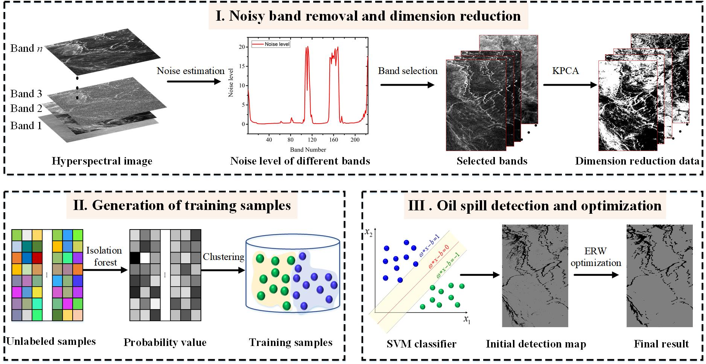

# Hyperspectral Remote Sensing Benchmark Database for Oil Spill Detection with an Isolation Forest-Guided Unsupervised Detector
The Matlab code for hyperspectral oil spill database will be released soon!

[Puhong Duan](https://scholar.google.ch/citations?hl=en&user=IYUlx_8AAAAJ&view_op=list_works&sortby=pubdate), [Xudong Kang](https://scholar.google.ch/citations?user=5XOeLZYAAAAJ&hl=en), [Pedram Ghamisi](https://scholar.google.ch/citations?user=Gr9afd0AAAAJ&hl=en)

___________

The code in this toolbox implements the ["Hyperspectral Remote Sensing Benchmark Database for Oil Spill Detection with an Isolation Forest-Guided Unsupervised Detector"](https://arxiv.org/abs/2209.14971). More specifically, it is detailed as follow.

Citation
---------------------

**Please kindly cite the papers if this code is useful and helpful for your research.**

P. Duan, X. Kang, and P. Ghamisi, "Hyperspectral Remote Sensing Benchmark Database for Oil Spill Detection with an Isolation Forest-Guided Unsupervised Detector," in arXiv, 2020, doi: 10.48550/ARXIV.2209.14971.

    @article{HOSD,
      title     = {Hyperspectral Remote Sensing Benchmark Database for Oil Spill Detection with an Isolation Forest-Guided Unsupervised Detector},
      author    = {Duan, Puhong and Kang, Xudong and Ghamisi, Pedram},
      journal   = {arXiv}, 
      year      = {2022},
      publisher = {arXiv},
      
     }

# How to use it?
This toolbox consists of an unsupervised hyperspectral oil spill detection approaches and a hyperspectral remote sensing oil spill benchmark database (HOSD) over Gulf of Mexico, which are freely and openly available from the following link, contributing to the community. For more details, please refer to the paper

Google drive: https://drive.google.com/file/d/1MKBcASK22931kqsUT886n7Ufdz3g_GZ8/view?usp=sharing

If these datasets and codes are helpful and useful for your research, please kindly cite our papers !!!

# Contact Information

Puhong Duan: puhpng_duan@hnu.edu.cn
